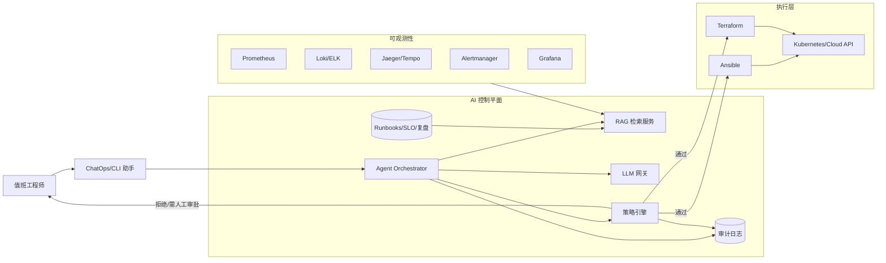

# AI + SRE 学习实战项目（从 0 到 1）

这个项目的目标是：

> 用 **AI 辅助运维与 SRE**，但保持“**安全可控、可审计、可回滚**”。

你可以把它理解为一个学习型实验平台：

- 先做 **只读分析**（告警总结、日志归因、排障建议）
- 再做 **低风险自动化**（经过策略和人工审批）
- 最后评估是否真的降低了 MTTR、提升了值班效率

---

## 1. 你将学到什么

完成本项目后，你应当具备以下能力：

1. 搭建可观测性基础设施（Metrics / Logs / Traces / Alerts）
2. 建立 SRE 知识库（Runbook、SLO、事故复盘）
3. 让 AI 基于实时数据 + 知识库做诊断建议（RAG）
4. 用策略引擎限制 AI 动作边界（Policy + Approval）
5. 记录审计日志，满足可追溯和复盘需求

---

## 2. 适合人群

- 想从传统运维转向 DevOps / SRE 的同学
- 想学习 AI Agent 在生产运维中的落地方式
- 想做“能演示、能扩展、可迭代”的个人项目

---

## 3. 总体架构图

> 详细版本见 `docs/architecture.md`

- 面向你提出的“Prompt 运维 + 故障自愈 + DevOps + 全栈监控”需求，可参考 `docs/ai-devops-blueprint.md`。



---

## 4. 分阶段实施（推荐路线）

## Phase 0：定义边界（1 天）

只选 3 个场景，避免一上来做太大：

1. “为什么某节点 CPU 持续过高？”
2. “请汇总当前 P1/P2 告警并按影响排序。”
3. “给出磁盘压力的低风险处置建议（不自动执行）。”

**成功标准**：

- 告警定位时间缩短
- 无未经审批的高风险变更
- AI 建议可追溯（有证据来源）

## Phase 1：可观测性基线（3~5 天）

最小集：

- Prometheus + Node Exporter
- Loki + Promtail
- Grafana + Alertmanager

落地任务：

- 至少 1 个 demo 服务接入监控
- 至少 5 条核心告警（CPU、内存、磁盘、错误率、延迟）
- 至少 3 个基础 Dashboard（主机、应用、告警）

## Phase 2：SRE 知识库（2~3 天）

把知识文档化并版本管理：

- `docs/runbooks/`：常见故障处理手册
- `docs/slos/`：SLO/SLI 定义
- `docs/postmortems/`：历史事故复盘

要求：

- 每篇 runbook 必须包含“触发条件、排查步骤、回滚方案、升级路径”
- 文档统一 Markdown，便于 RAG 索引

## Phase 3：只读 AI 助手（3~5 天）

功能目标：

- 汇总告警上下文
- 关联日志/指标，输出疑似根因列表
- 生成“下一步验证命令”

强约束：

- 不允许自动执行写操作
- 每条结论给出证据来源（仪表盘/日志片段/告警链接）

## Phase 4：低风险自动化（3~5 天）

只开放白名单动作（例如）：

- 重启非关键服务
- 清理已确认安全的临时目录
- 在限定区间内扩缩容无状态服务

必须具备：

- 策略校验（allow/deny）
- 中高风险动作人工审批
- 审计记录（谁、何时、执行了什么、为什么）

## Phase 5：效果评估（持续迭代）

建议指标：

- MTTD、MTTR
- 告警有效率（precision/recall）
- 误处置率
- 工程师主观信任度（问卷）

做法：

- 每周做一次 game day（故障演练）
- 对比“纯人工”与“AI 辅助”两种流程

---

## 5. 建议目录结构

```text
.
├── README.md
├── docs/
│   ├── architecture.md
│   ├── runbooks/
│   ├── slos/
│   └── postmortems/
├── infra/
│   ├── docker-compose.yml
│   ├── terraform/
│   └── ansible/
├── services/
│   ├── rag-service/
│   ├── agent-orchestrator/
│   └── policy-engine/
├── dashboards/
└── scripts/
```

---

## 6. MVP（建议先做这个）

目标：2~3 天做出可演示版本。

MVP 功能：

1. 拉取当前告警列表
2. 拉取近 15 分钟错误日志 TOP N
3. 调用 LLM 生成事故简报（Markdown）
4. 保存到 `docs/incidents/`

输出示例应包含：

- 影响范围
- 可能根因（含置信度）
- 建议验证步骤
- 建议缓解动作（默认只建议不执行）

---

## 7. 安全与治理清单

- [ ] 所有工具接入 RBAC
- [ ] 密钥统一托管（禁止明文写入提示词）
- [ ] Prompt/Response 做脱敏留档
- [ ] 动作令牌短时有效
- [ ] 审计日志不可篡改
- [ ] 低置信度自动升级人工
- [ ] 提供“人工接管（break glass）”模式

---

## 8. 30 天学习计划

- **第 1 周**：完成监控栈和核心告警
- **第 2 周**：补齐 runbooks + SLO 文档并建立索引
- **第 3 周**：实现只读 AI 助手（问答 + 告警总结）
- **第 4 周**：接入 1 个低风险自动化动作 + 审批流

---

## 9. 常见误区（非常重要）

1. **过早自动化执行**：应先只读，再逐步放开动作权限。
2. **无证据输出**：AI 回答必须引用实时数据或知识库条目。
3. **没有回滚方案**：每个自动动作必须可回退。
4. **没有审计链路**：出问题后无法复盘比故障本身更危险。

---

## 10. 下一步可以做什么

你可以继续在此仓库新增：

1. `infra/docker-compose.yml`（一键启动监控栈）
2. `services/agent-orchestrator/`（只读聚合接口）
3. `services/policy-engine/`（动作风控）
4. `docs/runbooks/`（至少 5 篇高频故障 runbook）

如果你愿意，我下一步可以直接帮你生成：

- 可运行的 `docker-compose.yml`
- Prometheus 抓取配置 + 示例告警规则
- 一个最小可用的“只读事故总结”服务（Python/Node）
