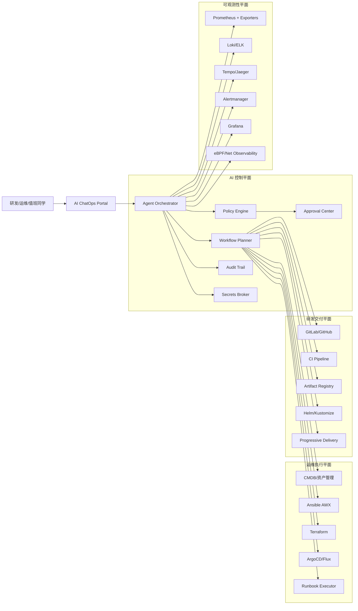

# 面向 Prompt 的 AI 运维与 DevOps 全链路方案

本文针对以下目标给出可落地蓝图：

1. 通过统一工具管理多台服务器，并支持“自然语言下发安装任务”（如 Docker/K8s 批量安装）。
2. 在 Docker/K8s 等基础设施故障时，AI 自动分析并给出处置建议，必要时执行受控修复。
3. 打通“编码 -> 构建 -> 发布 -> 运行 -> 回滚”的 AI 协助 DevOps 流程，具备版本控制与环境隔离能力。
4. 实现服务器、网络、基础设施、应用全层级实时监控，异常可被及时发现、上报、定位和处理。

---

## 1. 总体架构（One Platform）

---

## 2. 对应你的 4 个需求

### 2.1 需求 1：AI 驱动的服务器统一管理与批量安装

**推荐能力组合：**

- **资产统一**：CMDB（主机、角色、环境、网络区、责任人、风险级别）。
- **执行统一**：Ansible AWX + Terraform（主机配置与云资源分层管理）。
- **入口统一**：ChatOps（企业微信/Slack/飞书机器人 + Web 控制台）。

**典型 Prompt：**

- “在 `prod-web` 主机组安装 Docker 24.x，并开启开机启动。”
- “为 `staging-k8s` 集群批量安装 containerd + kubeadm + CNI。”

**系统处理流程：**

1. LLM 将自然语言转为结构化任务（目标主机组、动作、版本、并发、回滚策略）。
2. Policy Engine 做风险判断（是否生产环境、是否越权、是否高危动作）。
3. 通过后生成 Ansible Playbook 参数并执行；失败自动触发回滚步骤。
4. 全过程写入审计日志（请求人、审批人、执行命令、主机列表、结果）。

---

### 2.2 需求 2：Docker/K8s 故障 AI 分析与修复

**诊断输入源：**

- 指标：节点资源、容器重启、Pod Pending、API Server 延迟。
- 日志：kubelet、container runtime、核心业务日志。
- 事件：K8s Event、变更记录、近期发布记录。
- 拓扑：Service 依赖图、网络路径、DNS 解析路径。

**AI 故障处理链路：**

1. AI 自动汇总“告警 + 日志 + 事件 + 最近变更”。
2. 输出候选根因（含置信度）与证据链接。
3. 生成验证命令（只读）供工程师确认。
4. 若命中低风险自动化规则（如重建异常 Pod），可自动执行。
5. 若高风险（如重启 master 组件），必须人工审批。

**建议先开放的自动化动作（低风险白名单）：**

- 驱逐单个异常 Pod 并观察重建。
- 重启单节点非关键 DaemonSet。
- 自动清理已确认安全的磁盘临时目录。

---

### 2.3 需求 3：AI 协助 DevOps 全流程 + 回滚

**推荐技术栈（可替换同类产品）：**

- **版本控制**：GitHub/GitLab（代码 + IaC + Runbook 同仓或多仓管理）。
- **环境隔离**：dev/staging/prod 三环境，独立命名空间与独立密钥。
- **持续交付**：CI（构建/测试/扫描） + ArgoCD（GitOps 发布）。
- **发布策略**：Canary / Blue-Green / Progressive Delivery（Argo Rollouts）。
- **一键回滚**：基于 Git tag / Helm revision / Argo rollout history。

**AI 在交付链路中的职责：**

- 代码提交后自动生成变更摘要与风险评分。
- 发布前根据历史事故和 SLO 预测风险，建议发布窗口。
- 发布中实时观察错误率/延迟，达到阈值自动暂停或回滚。
- 发布后自动生成复盘草稿。

**回滚 Prompt 示例：**

- “将 `payments` 服务从 `v2.3.7` 回滚到上一个稳定版本，并给出影响范围。”

---

### 2.4 需求 4：全层级全生命周期监控与自动响应

**分层监控模型：**

1. **基础层**：服务器 CPU/内存/磁盘、内核、系统调用异常。
2. **网络层**：丢包、重传、RTT、南北向与东西向流量异常。
3. **平台层**：Docker/K8s 组件健康、调度状态、控制面可用性。
4. **应用层**：RED/USE 指标、业务 SLA、关键交易成功率。
5. **变更层**：部署、配置修改、扩缩容、证书变更。

**事件闭环：发现 -> 上报 -> 定位 -> 处置 -> 复盘**

- 发现：Alertmanager + 异常检测模型。
- 上报：ChatOps 推送（按服务 owner 路由）。
- 定位：AI 聚合上下文并给出优先排查路径。
- 处置：Runbook 自动执行/人工审批执行。
- 复盘：自动沉淀到知识库，反哺下次诊断。

---

## 3. 安全与治理（必须先做）

- **RBAC + ABAC**：基于角色和环境双重控制。
- **最小权限**：默认 deny，仅开放白名单动作。
- **双人审批**：生产高风险动作必须双人审批。
- **审计不可篡改**：记录 Prompt、模型输出、执行命令和结果。
- **密钥托管**：使用 Vault/KMS，禁止明文写入 Prompt。
- **模型防护**：Prompt 注入检测、敏感命令拦截、越权检测。

---

## 4. 分阶段落地路线（12 周示例）

### Phase A（第 1-2 周）：统一资产与可观测性基线

- 建立 CMDB 与主机分组。
- 落地 Prometheus/Loki/Grafana/Alertmanager。
- 建立 10 条核心告警（主机 + K8s + 应用）。

### Phase B（第 3-5 周）：AI 只读诊断

- 打通 ChatOps -> AI -> 监控/日志/RAG。
- 输出“根因候选 + 证据 + 验证命令”。
- 严禁自动写操作。

### Phase C（第 6-8 周）：低风险自动化执行

- 接入 Ansible AWX + Policy + Approval。
- 开放 3~5 个低风险动作白名单。
- 审计报表可按人、环境、系统维度查询。

### Phase D（第 9-12 周）：DevOps 全链路与自动回滚

- 打通 GitOps、灰度发布、回滚策略。
- 建立发布 SLO 守门规则（错误率、延迟、饱和度）。
- 支持 AI 指令触发回滚并生成事件总结。

---

## 5. MVP 清单（建议先上线）

1. 输入一句 Prompt，批量在测试机安装 Docker。
2. AI 自动分析一个 K8s Pod 异常并输出修复建议。
3. 支持一次灰度发布 + 自动回滚演示。
4. 关键监控告警可在 ChatOps 中一键查看上下文。

> 有了这个 MVP，你就能验证“AI 是否真的降低 MTTR 与值班负担”，再决定扩大自动化边界。
