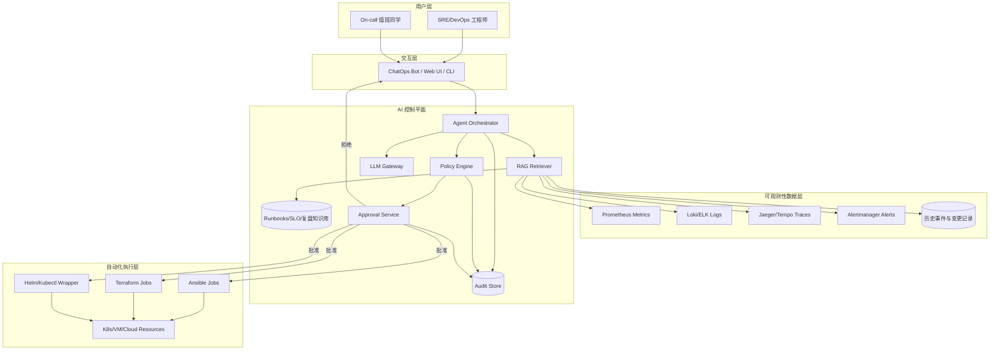

# AI + SRE 学习项目架构说明

本文给出该项目的实现架构与设计原则，目标是：

- 先实现“**AI 辅助诊断**”，再实现“**AI 辅助执行**”
- 严格控制执行权限，确保安全、可审计、可回滚

## 1. 组件架构图

## 2. 数据流（一次典型告警处理）

1. Alertmanager 触发告警并进入交互层。
2. Agent 拉取告警上下文（指标、日志、链路、最近变更）。
3. RAG 检索 runbook / 历史复盘，LLM 生成分析结论。
4. 若仅为建议类输出，直接返回工程师。
5. 若涉及执行动作，先过策略引擎，再走审批服务。
6. 执行动作后写入审计日志并回传结果。

## 3. 设计原则

- **只读优先**：先证明分析价值，再开放自动执行。
- **最小权限**：默认 deny，按动作白名单放行。
- **人工兜底**：中高风险动作必须人工审批。
- **证据驱动**：每条结论都应可追溯到数据来源。
- **全链路审计**：输入、决策、执行、结果均可回放。

## 4. 最小可用落地建议

- 第一步：打通 `UI -> Agent -> RAG -> LLM` 的只读链路。
- 第二步：接入 `Policy + Approval`，但只放开 1 个低风险动作。
- 第三步：用 game day 验证 MTTR 和误处置率变化。
